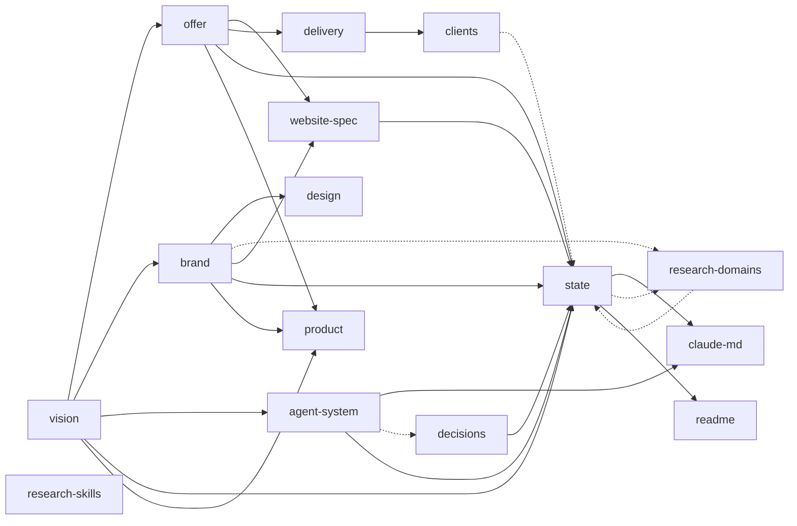

<!-- GENERATED BY ops/scripts/build-kb-graph.mjs — DO NOT EDIT BY HAND.
     Regenerate with `npm run kb`. Edit the frontmatter in the source docs instead. -->

# Knowledge graph

The map of this repo's knowledge base. **Read this first** — it tells you which document answers
your question, so you open one file instead of six.

Edges are declared, not inferred: each doc's frontmatter names what it `depends_on`, and
`npm run kb` refuses to build when an edge points at nothing. Prose cross-references rot
silently; this does not.

Generated 2026-08-01 · 15 nodes · 21 decisions

## Map

Solid arrow = declared dependency (`depends_on`). Dotted = a body reference (`[[link]]`).

## Where to look

| Question | Read |
|---|---|
| What is this venture, who are we, what is out of scope? | [`vision`](00-vision.md) |
| What do we sell, at what price, to whom? | [`offer`](01-offer.md) |
| What may I write, what may I not? Colours, voice, banned words? | [`brand`](02-brand.md) |
| What is the website supposed to be? | [`website-spec`](03-website-spec.md) |
| How do we run a client project? | [`delivery`](04-delivery-playbook.md) |
| Why is something the way it is? | [`decisions`](05-decisions.md) |
| How do the agents work together? | [`agent-system`](06-agent-system.md) |
| **Where do things stand right now?** | [`state`](STATE.md) |

## Nodes

| id | title | type | status | owner | updated | file | feeds |
|---|---|---|---|---|---|---|---|
| `claude-md` | CLAUDE.md (constitution) | constitution | active | partner-b | — | [CLAUDE.md](../CLAUDE.md) | — |
| `design` | DESIGN.md (visual world) | artifact | active | partner-b | — | [DESIGN.md](../DESIGN.md) | — |
| `vision` | Vision & operating model | knowledge | active | founders | 2026-07-27 | [docs/00-vision.md](00-vision.md) | `offer`, `brand`, `agent-system`, `state`, `product` |
| `offer` | Offer & packages | knowledge | active | founders | 2026-07-31 | [docs/01-offer.md](01-offer.md) | `website-spec`, `delivery`, `state`, `product` |
| `brand` | Brand | knowledge | active | partner-b | 2026-08-01 | [docs/02-brand.md](02-brand.md) | `website-spec`, `state`, `design`, `product` |
| `website-spec` | Website spec | spec | active | partner-b | 2026-08-01 | [docs/03-website-spec.md](03-website-spec.md) | `state` |
| `delivery` | Delivery playbook | playbook | active | founders | 2026-07-26 | [docs/04-delivery-playbook.md](04-delivery-playbook.md) | `clients` |
| `decisions` | Decision log | decision-log | active | founders | 2026-08-01 | [docs/05-decisions.md](05-decisions.md) | `state` |
| `agent-system` | Agent system & orchestration loop | knowledge | active | partner-b | 2026-08-01 | [docs/06-agent-system.md](06-agent-system.md) | `state`, `claude-md` |
| `clients` | Client workspaces | client | active | founders | 2026-08-01 | [docs/clients/README.md](clients/README.md) | — |
| `research-skills` | Research — Claude Code skills | research | active | partner-b | 2026-07-27 | [docs/research/claude-skills.md](research/claude-skills.md) | — |
| `research-domains` | Research — domain availability | research | active | partner-b | 2026-08-01 | [docs/research/domain-availability.md](research/domain-availability.md) | — |
| `state` | Where things stand | state | active | partner-b | 2026-08-01 | [docs/STATE.md](STATE.md) | `claude-md`, `readme` |
| `product` | PRODUCT.md (product schema) | artifact | active | partner-b | — | [PRODUCT.md](../PRODUCT.md) | — |
| `readme` | README.md (repo map) | artifact | active | partner-b | — | [README.md](../README.md) | — |

**knowledge**: `agent-system`, `brand`, `offer`, `vision` · **spec**: `website-spec` · **playbook**: `delivery` · **research**: `research-domains`, `research-skills` · **client**: `clients`

## Decisions

Append-only log. Superseded entries are struck through — they are history, not state.
A doc may only cite a live decision; citing a superseded one fails the build.

| # | date | decision | status | cited by |
|---|---|---|---|---|
| ~~D-001~~ | 2026-07-26 | Name: Klarfluss | SUPERSEDED by D-016 | — |
| D-002 | 2026-07-26 | Stack: Astro 5 + Tailwind + MDX, Cloudflare Pages, Plausible | DECIDED | `website-spec` |
| D-003 | 2026-07-26 | Palette: A — Signal | DECIDED | `brand` |
| D-004 | 2026-07-26 | Scope v1 | DECIDED | `vision` |
| D-005 | 2026-07-26 | Legal vehicle | PENDING | — |
| ~~D-006~~ | 2026-07-26 | Domain: klarfluss.eu | SUPERSEDED by D-016 | — |
| ~~D-007~~ | 2026-07-26 | v1 package prices | SUPERSEDED by D-018 | — |
| D-008 | 2026-07-26 | Legal/admin items: covered by founders | DECIDED | `vision` |
| D-009 | 2026-07-26 | Skill arsenal: maximal | DECIDED | `research-skills` |
| D-010 | 2026-07-26 | Bilingual DE/EN from v1; name provisional until demo review | DECIDED | `website-spec` |
| D-011 | 2026-07-26 | Premium motion layer on the landing page | DECIDED | — |
| D-012 | 2026-07-26 | No FAQ — objections answered inside a narrative | DECIDED | — |
| D-013 | 2026-07-26 | Contact: real form, mailto only as fallback | DECIDED | `website-spec` |
| ~~D-014~~ | 2026-07-26 | Name: NextBridge | SUPERSEDED by D-016 (one day later) | — |
| D-015 | 2026-07-26 | Published preview on Cloudflare Pages | DECIDED | `website-spec` |
| D-016 | 2026-07-27 | Name: NexBridge-IT · Domain: nexbridge-it.de | DECIDED | `brand`, `research-domains`, `state` |
| D-017 | 2026-07-27 | Open to AI crawlers; SEO baseline shipped | DECIDED | `website-spec` |
| D-018 | 2026-07-27 | Pricing: one public price only | DECIDED — supersedes D-007 | `offer`, `state` |
| D-019 | 2026-08-01 | Repo lives at C:\Users\manus\Projects\nexbridge-it | DECIDED | — |
| D-020 | 2026-08-01 | Knowledge base is a generated graph; STATE.md is the bootstrap | DECIDED | — |
| D-021 | 2026-08-01 | Orchestration: tiered loop, gates, 3-iteration cap | DECIDED | `agent-system` |

### ⏳ Pending — work that depends on these is blocked

- **D-005** — Legal vehicle

---

_15 nodes, 25 edges, 0 broken. Rebuild: `npm run kb`._
